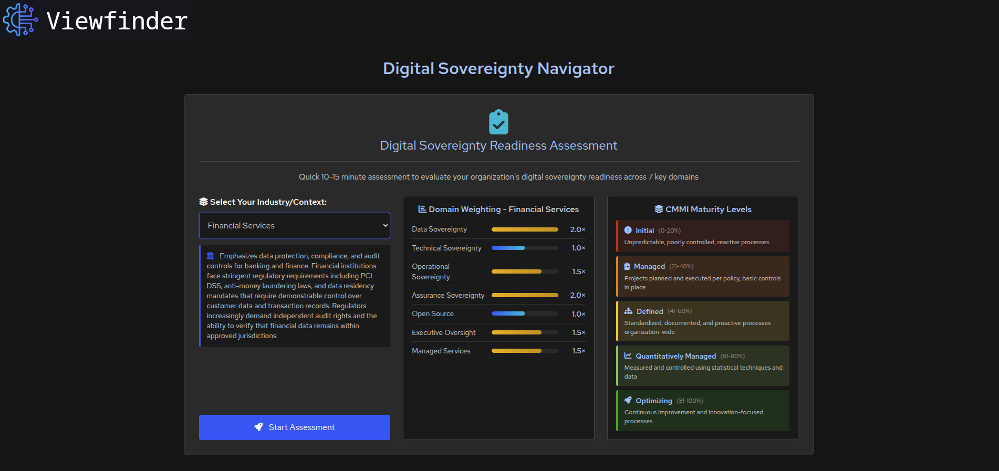
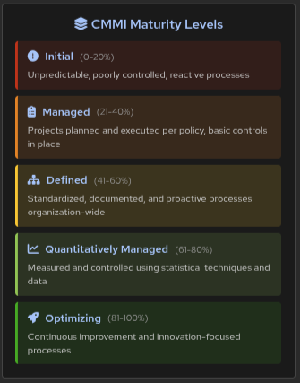
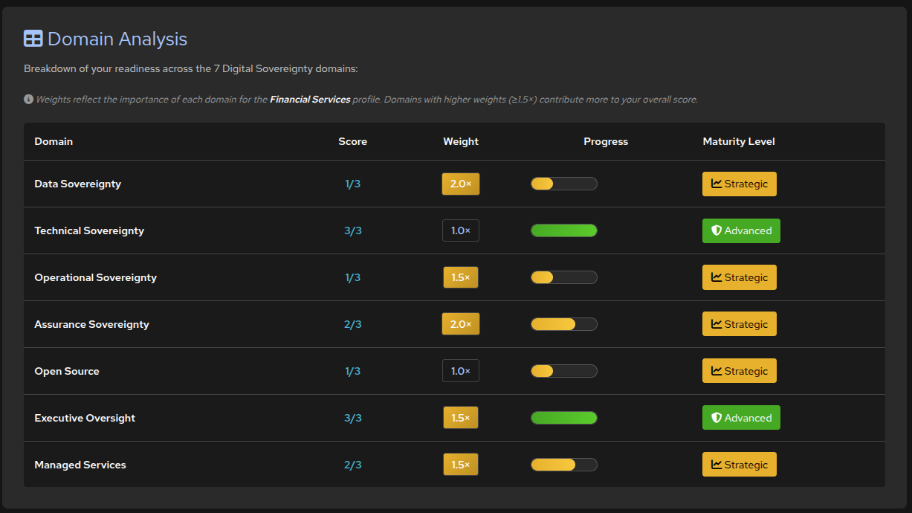

# Viewfinder Lite

A streamlined Digital Sovereignty assessment tool focused on providing organizations with a quick and actionable readiness evaluation.

## Overview

Viewfinder Lite is a simplified version of the comprehensive Viewfinder Assessment Platform, containing only the Digital Sovereignty Readiness Assessment component. This tool helps organizations evaluate their digital sovereignty posture across 7 critical domains in just 10-15 minutes.

## Screenshots

### Landing Page - Balanced Profile
The landing page features a profile selector with real-time domain weight visualization. The Balanced profile shows equal weighting across all domains.


### Landing Page - Custom Profile
The Custom profile option allows users to adjust domain weights from 1.0× to 2.0× using interactive sliders, with real-time visualization updates.


### Landing Page - Financial Services Profile
The Financial Services profile demonstrates industry-specific weighting with critical emphasis on Data Sovereignty (2.0×) and Assurance Sovereignty (2.0×) to address regulatory requirements like PCI DSS and audit controls.



### CMMI Maturity Levels
The five CMMI maturity levels (Initial, Managed, Defined, Quantitatively Managed, Optimizing) provide a framework for evaluating digital sovereignty readiness with color-coded indicators and percentage ranges.



### Assessment Page
The assessment questionnaire presents 21 questions across 7 domains with Yes/No/"Don't Know" response options. Progress is auto-saved to browser storage.


### Results Pages
Comprehensive results display showing weighted scoring, maturity level, domain analysis, and actionable recommendations.





### PDF Report
Professional PDF report with weighted scores, domain breakdown, maturity level assessment, and tailored improvement actions.


## Features

### Digital Sovereignty Readiness Assessment
- **Quick Assessment**: Complete evaluation in 10-15 minutes
- **7 Critical Domains**: Comprehensive coverage across:
  - Data Sovereignty
  - Technical Sovereignty
  - Operational Sovereignty
  - Assurance Sovereignty
  - Open Source Strategy
  - Executive Oversight
  - Managed Services
- **21 Key Questions**: 2-3 targeted questions per domain
- **Multiple Response Options**: Yes/No/"Don't Know" format
- **Industry-Specific Profiles**: 8 pre-configured weighting profiles tailored to different sectors
- **Custom Weighting**: Adjustable domain weights (1.0× to 2.0×) for personalized assessments
- **Weighted Scoring**: Intelligent scoring that prioritizes critical domains based on selected profile
- **Instant Scoring**: Real-time maturity level calculation
- **Maturity Levels**: CMMI-aligned 5-level model (Initial, Managed, Defined, Quantitatively Managed, Optimizing)
- **Actionable Recommendations**: Tailored guidance based on assessment results
- **Research Questions**: Track "Don't Know" responses for follow-up investigation
- **PDF Export**: Professional downloadable reports with profile information
- **Progress Auto-Save**: Browser-based session persistence
- **Keyboard Navigation**: Arrow keys for quick navigation, Ctrl+S to save

## Installation

### Prerequisites
- PHP 8.1 or higher
- Apache or Nginx web server
- Composer (for dependency management)

### Local Installation

1. **Clone or extract the application**:
   ```bash
   cd /var/www/html/viewfinder-lite
   ```

2. **Install dependencies**:
   ```bash
   composer install --no-dev --optimize-autoloader
   ```

3. **Set file permissions**:
   ```bash
   # Set ownership (adjust user/group for your system)
   sudo chown -R apache:apache /var/www/html/viewfinder-lite

   # Set directory permissions
   sudo chmod 755 /var/www/html/viewfinder-lite
   sudo chmod 775 /var/www/html/viewfinder-lite/logs

   # Set file permissions
   find /var/www/html/viewfinder-lite -type f -exec chmod 644 {} \;
   ```

4. **Configure web server**:
   - See [Web Server Configuration](#web-server-configuration) below

5. **Access the application**:
   ```
   http://your-server/viewfinder-lite
   ```

### Podman Installation

1. **Build the container**:
   ```bash
   cd /var/www/html/viewfinder-lite
   podman build -t viewfinder-lite:latest .
   ```

2. **Run the container**:
   ```bash
   podman run -d -p 8080:8080 --name viewfinder-lite viewfinder-lite:latest
   ```

3. **Access the application**:
   ```
   http://localhost:8080
   ```

## Web Server Configuration

### Apache Configuration

**VirtualHost Example** (`/etc/httpd/conf.d/viewfinder-lite.conf`):
```apache
<VirtualHost *:80>
    ServerName viewfinder-lite.example.com
    DocumentRoot /var/www/html/viewfinder-lite

    <Directory /var/www/html/viewfinder-lite>
        Options -Indexes +FollowSymLinks
        AllowOverride All
        Require all granted

        # Security headers
        Header always set X-Content-Type-Options "nosniff"
        Header always set X-Frame-Options "SAMEORIGIN"
        Header always set X-XSS-Protection "1; mode=block"
    </Directory>

    # Logging
    ErrorLog /var/log/httpd/viewfinder-lite-error.log
    CustomLog /var/log/httpd/viewfinder-lite-access.log combined
</VirtualHost>
```

### Nginx Configuration

**Server Block Example** (`/etc/nginx/conf.d/viewfinder-lite.conf`):
```nginx
server {
    listen 80;
    server_name viewfinder-lite.example.com;
    root /var/www/html/viewfinder-lite;
    index index.php;

    # Security headers
    add_header X-Content-Type-Options "nosniff" always;
    add_header X-Frame-Options "SAMEORIGIN" always;
    add_header X-XSS-Protection "1; mode=block" always;

    location / {
        try_files $uri $uri/ /index.php?$query_string;
    }

    location ~ \.php$ {
        fastcgi_pass unix:/var/run/php-fpm/php-fpm.sock;
        fastcgi_index index.php;
        fastcgi_param SCRIPT_FILENAME $document_root$fastcgi_script_name;
        include fastcgi_params;
    }

    # Deny access to sensitive files
    location ~ /\. {
        deny all;
    }

    # Logging
    access_log /var/log/nginx/viewfinder-lite-access.log;
    error_log /var/log/nginx/viewfinder-lite-error.log;
}
```

## File Structure

```
viewfinder-lite/
├── index.php                    # Landing page
├── composer.json                # PHP dependencies
├── composer.lock                # Dependency lock file
├── Dockerfile                   # Container build configuration
├── README.md                    # This file
├── CHANGES.md                   # Change log
├── IMPLEMENTATION_SUMMARY.txt   # Implementation details
│
├── ds-qualifier/                # Digital Sovereignty Readiness Assessment
│   ├── index.php               # Assessment questionnaire interface
│   ├── results.php             # Results and recommendations page
│   ├── config.php              # Questions configuration
│   ├── profiles.php            # Weighting profiles (industry-specific)
│   ├── generate-pdf.php        # PDF report generator
│   ├── css/
│   │   └── ds-qualifier.css    # Assessment-specific styles
│   └── js/
│       └── ds-qualifier.js     # Interactive features & auto-save
│
├── includes/                    # Core backend classes
│   ├── Config.php              # Application configuration
│   ├── Security.php            # Security utilities
│   ├── Logger.php              # Logging functionality
│   └── Exceptions/             # Custom exception classes
│       ├── ViewfinderException.php
│       ├── FileSystemException.php
│       ├── DataValidationException.php
│       ├── ConfigurationException.php
│       ├── ViewfinderJsonException.php
│       └── ProfileException.php
│
├── css/                         # Shared stylesheets
│   ├── bootstrap.min.css       # Bootstrap framework
│   ├── brands.css              # Font Awesome brands
│   ├── style.css               # Main application styles
│   ├── tab-dark.css            # Dark theme tab styling
│   ├── patternfly.css          # Red Hat PatternFly design system
│   └── patternfly-addons.css   # PatternFly extensions
│
├── js/                          # Shared JavaScript files
│
├── images/                      # Images and logos
│   ├── viewfinder-logo.png
│   └── screenshots/             # Documentation screenshots
│       ├── landing-page-balanced.png
│       ├── landing-page-custom.png
│       ├── landing-page-financial.png
│       ├── cmmi-levels.png
│       ├── assessment-page.png
│       ├── results-page1.png
│       ├── results-page2.png
│       ├── results-page3.png
│       └── pdf-report-sample.png
│
├── error-pages/                 # Error handling pages
│   └── error-handler.php
│
├── logs/                        # Application logs (created at runtime)
│
└── vendor/                      # Composer dependencies (created by composer install)
```

## Usage

### Landing Page
Navigate to the root URL to access the landing page featuring the Digital Sovereignty Readiness Assessment card.

### Selecting a Profile

Before starting the assessment, choose a weighting profile that matches your organization's industry and priorities:

#### Available Profiles

1. **Balanced** (Default)
   - Equal weighting across all domains
   - Ideal for general assessments or organizations starting their digital sovereignty journey

2. **Financial Services**
   - Emphasizes Data Sovereignty (2.0×) and Assurance Sovereignty (2.0×)
   - Tailored for banking, finance, and payment processing organizations
   - Addresses PCI DSS, anti-money laundering, and regulatory audit requirements

3. **Healthcare**
   - Prioritizes Data Sovereignty (2.0×) and Operational Sovereignty (2.0×)
   - Designed for hospitals, clinics, and health data processors
   - Addresses HIPAA, patient data protection, and life-critical system availability

4. **Government & Public Sector**
   - High weighting across Data (2.0×), Assurance (2.0×), and Executive Oversight (2.0×)
   - For government agencies and public sector organizations
   - Addresses NIS2, FedRAMP, and national security requirements

5. **Technology & SaaS**
   - Focuses on Technical Sovereignty (2.0×) and Open Source (2.0×)
   - For software companies, SaaS providers, and tech startups
   - Emphasizes vendor lock-in avoidance and innovation agility

6. **Manufacturing & Industrial**
   - Emphasizes Operational Sovereignty (2.0×) and Managed Services (2.0×)
   - For manufacturing plants and industrial operations
   - Addresses production uptime and OT/IT integration

7. **Telecommunications**
   - Prioritizes Data (2.0×), Operational (2.0×), and Assurance Sovereignty (2.0×)
   - For telecom operators and network service providers
   - Addresses critical infrastructure and NIS2 compliance

8. **Energy & Utilities**
   - Focuses on Operational Sovereignty (2.0×) and Assurance Sovereignty (2.0×)
   - For power generation, distribution, and utility companies
   - Addresses critical infrastructure protection and NERC CIP

9. **Custom**
   - Fully customizable domain weights (1.0× to 2.0× in 0.5 increments)
   - Adjust sliders to match your specific priorities
   - Real-time visualization of weight distribution

#### How Weighting Works

- **Standard (1.0×)**: Normal priority
- **Higher (1.5×)**: Increased importance
- **Critical (2.0×)**: Maximum priority

Domains with higher weights contribute more to your overall maturity score. For example, in the Financial Services profile, a strong Data Sovereignty score has twice the impact of a strong Open Source score.

### Taking an Assessment

1. **Select Profile**: Choose your industry profile or select "Custom" to set your own weights
2. **Review Domain Weights**: Check the visualization to understand which domains are prioritized
3. **Start Assessment**: Click "Start Assessment" button to begin
4. **Answer Questions**: Progress through 7 domains
   - Use Next/Previous buttons to navigate
   - Answer Yes/No or select "Don't Know" for uncertain items
   - Questions are validated before proceeding
   - Progress auto-saves to browser storage
5. **Submit**: Click "Complete Assessment" on the final section
6. **View Results**: Review your maturity level and recommendations
7. **Download Report**: Generate PDF report with profile information for stakeholders
8. **Take New Assessment**: Start fresh assessment anytime

### Understanding Results

#### Weighted Scoring System

The assessment uses a **weighted scoring algorithm** that considers both your answers and the domain weights from your selected profile:

1. **Domain Score**: Calculated for each domain (0-100% based on "Yes" answers)
2. **Weight Application**: Each domain score is multiplied by its weight (1.0× - 2.0×)
3. **Normalization**: Weighted scores are normalized to a 0-21 scale
4. **Maturity Level**: Final score determines your overall maturity level

**Example**: In the Financial Services profile, if you score 67% in Data Sovereignty (weight 2.0×), this contributes more to your overall score than 67% in Open Source (weight 1.0×).

#### Maturity Levels

Based on your **weighted score** (0-21 points), aligned with the **CMMI (Capability Maturity Model Integration)** framework:

- **Initial (0-4.2 points / 0-20%)**: Ad-hoc and unpredictable
  - Processes are unpredictable, poorly controlled, and reactive
  - Success depends on individual heroics rather than proven processes
  - Significant dependencies on external providers with minimal sovereignty controls
  - Focus: Establish executive awareness and basic policies

- **Managed (4.21-8.4 points / 21-40%)**: Project-level management
  - Projects are planned and executed in accordance with policy
  - Requirements are managed, but processes may not be repeatable organization-wide
  - Basic controls are in place but not yet standardized
  - Focus: Build repeatable practices and implement foundational controls

- **Defined (8.41-12.6 points / 41-60%)**: Standardized and proactive
  - Processes are well characterized, understood, documented, and standardized
  - Digital sovereignty practices are consistent and repeatable across the organization
  - Clear governance structures and policies are in place
  - Focus: Ensure organization-wide consistency and pursue certifications

- **Quantitatively Managed (12.61-16.8 points / 61-80%)**: Measured and controlled
  - Processes are measured and controlled using quantitative data and statistical techniques
  - Quantitative objectives established for quality and performance
  - Process variations are understood and controlled
  - Focus: Optimize through data-driven decisions and performance metrics

- **Optimizing (16.81-21 points / 81-100%)**: Continuous improvement
  - Focus on continuous improvement through quantitative feedback and innovation
  - Proactive identification and deployment of innovative sovereignty practices
  - Industry-leading posture with thought leadership contributions
  - Focus: Drive innovation and lead industry best practices

#### Results Components

- **Profile Information**: Selected profile name and description
- **Weighted Score**: Your final score after profile weights are applied
- **Raw Score**: Unweighted score (for reference)
- **Score Breakdown**: Percentage-based maturity indicator
- **Domain Analysis Table**: Shows score, applied weight, and maturity level per domain
  - Critical domains (weight ≥1.5×) highlighted in orange
  - Progress bars show percentage completion per domain
- **Improvement Actions**: Recommended next steps based on maturity level
- **Domain Insights**: Detailed view of strengths and improvement areas
- **Research Questions**: "Don't Know" responses flagged for further investigation

## Configuration

### Application Settings
Edit `includes/Config.php` to modify:
- Application name and version
- Base paths
- Error handling settings
- Security configuration

### Assessment Questions
Edit `ds-qualifier/config.php` to customize:
- Question text
- Domain definitions
- Tooltips and help text
- Individual question weights (currently unused - domain-level weighting is used instead)

### Weighting Profiles
Edit `ds-qualifier/profiles.php` to customize or add new profiles:
- Profile name, description, and icon
- Domain weights (1.0 to 2.0 scale)
- Industry-specific context

**Adding a New Profile**:
```php
'profile-key' => [
    'name' => 'Profile Display Name',
    'description' => 'Detailed description including industry context',
    'icon' => 'fa-icon-name',
    'weights' => [
        'Data Sovereignty' => 1.5,
        'Technical Sovereignty' => 2.0,
        'Operational Sovereignty' => 1.0,
        'Assurance Sovereignty' => 1.5,
        'Open Source' => 1.0,
        'Executive Oversight' => 1.0,
        'Managed Services' => 1.5
    ]
]
```

## Dependencies

### PHP Requirements
- **PHP**: ^8.1
- **Extensions**: ext-json

### Composer Packages
- **monolog/monolog** (^3.5): Logging framework
- **dompdf/dompdf** (^3.1): PDF report generation

### Frontend Libraries (CDN)
- jQuery 3.6.0
- jQuery UI 1.13.2
- Font Awesome 8.x
- Bootstrap (included locally)
- PatternFly (included locally)

## Security Features

- **Input Validation**: Comprehensive sanitization of all user inputs
- **CSRF Protection**: Session-based CSRF token validation
- **Secure Headers**: X-Content-Type-Options, X-Frame-Options, X-XSS-Protection
- **Path Traversal Prevention**: Secure file path handling
- **Error Logging**: Detailed logging without exposing sensitive data
- **Session Timeout**: Automatic session expiration (1 hour)
- **Secure File Operations**: Atomic file writes with rollback capability

## Comparison with Full Viewfinder

| Feature | Full Viewfinder | Viewfinder Lite |
|---------|----------------|-----------------|
| Profile Management | ✓ | ✗ |
| Full Maturity Assessments | ✓ | ✗ |
| Readiness Assessment | ✓ | ✓ |
| Digital Sovereignty Quiz | ✓ | ✗ |
| Operation Sovereign Shield | ✓ | ✗ |
| Compliance Framework Mapping | ✓ | ✗ |
| Line of Business Content | ✓ | ✗ |
| Approximate Size | ~100+ MB | ~60-65 MB |

## Troubleshooting

### Common Issues

**Issue**: Permission denied errors
```bash
# Solution: Set correct ownership and permissions
sudo chown -R apache:apache /var/www/html/viewfinder-lite
sudo chmod 755 /var/www/html/viewfinder-lite
sudo chmod 775 /var/www/html/viewfinder-lite/logs
```

**Issue**: Composer dependencies not found
```bash
# Solution: Run composer install
cd /var/www/html/viewfinder-lite
composer install --no-dev --optimize-autoloader
```

**Issue**: PDF generation fails
```bash
# Solution: Check dompdf is installed
composer show dompdf/dompdf
# If not found, reinstall dependencies
composer install --no-dev --optimize-autoloader
```

**Issue**: Sessions not persisting
```bash
# Solution: Check session directory permissions
sudo chmod 1733 /var/lib/php/session  # For RHEL/CentOS
sudo chmod 1733 /var/lib/php/sessions # For Debian/Ubuntu
```

### Logging

View application logs for troubleshooting:

```bash
# View recent logs
tail -f /var/www/html/viewfinder-lite/logs/app.log

# Search for errors
grep ERROR /var/www/html/viewfinder-lite/logs/app.log

# View web server logs
tail -f /var/log/httpd/error_log    # Apache (RHEL/CentOS)
tail -f /var/log/apache2/error.log  # Apache (Debian/Ubuntu)
tail -f /var/log/nginx/error.log    # Nginx
```

## Development

### Adding Custom Questions

1. Edit `ds-qualifier/config.php`
2. Add questions to the appropriate domain
3. Follow the existing format:
   ```php
   'questions' => [
       [
           'id' => 'unique-id',
           'text' => 'Your question text?',
           'tooltip' => 'Helpful explanation'
       ]
   ]
   ```

### Customizing Styling

- **Main application**: Edit `css/style.css`
- **Assessment interface**: Edit `ds-qualifier/css/ds-qualifier.css`
- **Dark theme**: Edit `css/tab-dark.css`

### Modifying Maturity Levels

Edit `ds-qualifier/results.php` to adjust:
- Score thresholds
- Maturity level names
- Recommendations per level

## License

Apache-2.0 License - Red Hat

## Support

For issues, questions, or feature requests, please refer to the main Viewfinder project documentation or contact your Red Hat representative.

## Disclaimer

This application is provided for informational purposes only. The information is provided "as is" with no guarantee or warranty of accuracy, completeness, or fitness for a particular purpose. Users should conduct their own validation and testing before relying on assessment results for decision-making.

---

**Viewfinder Lite** - Streamlined Digital Sovereignty Readiness Assessment

Version: 1.1.0
